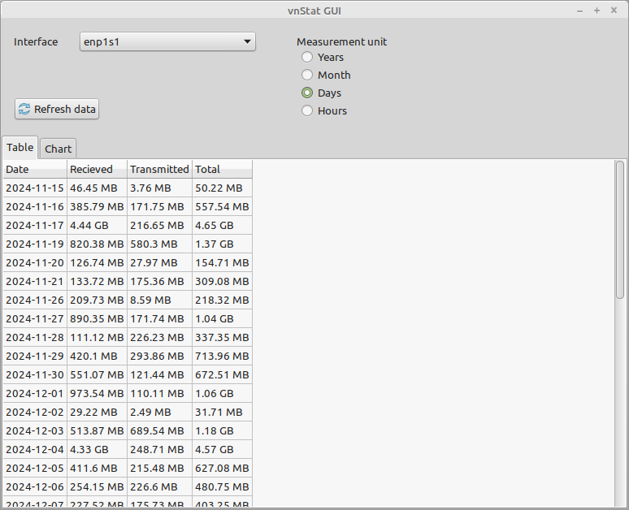
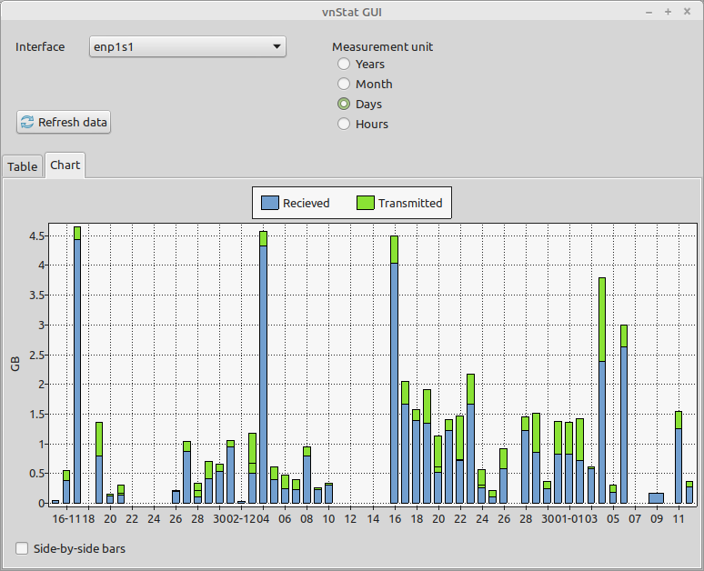
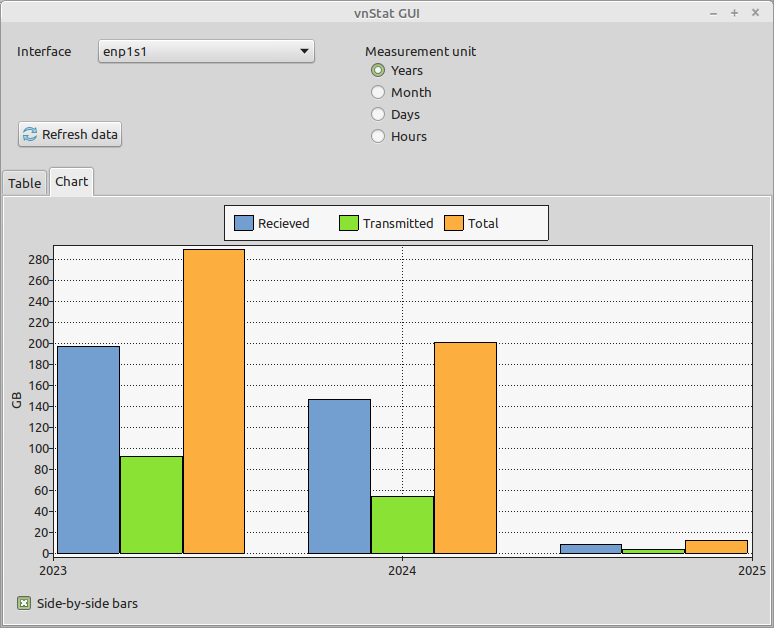
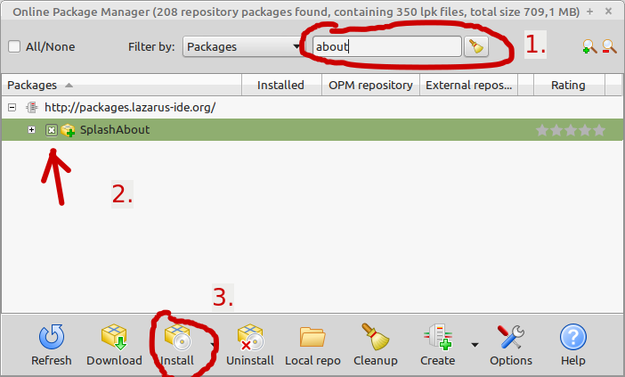
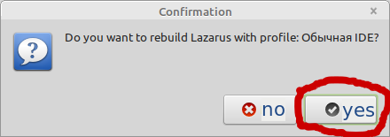

# vnStat GUI

Graphical interface for [vnStat](https://en.wikipedia.org/wiki/VnStat) console traffic monitor. It simply calls `vnstat` command with `--json` argument and parse output.







# Requirements

- Linux os
- vnstat installed and configured

# How to build from source

Download and install Lazarus IDE and Free Pascal compiler from [www.lazarus-ide.org](https://www.lazarus-ide.org/index.php?page=downloads). You should install 3 packages: `fpc-laz`, `fpc-src` and `lazarus-project`.

Start Lazarus and create new project (choose "Application" type). Open "Package --> Online Package Manager". Find and install "SplashAbout" package.



In next dialog confirm to rebuild IDE.



This will take some time and IDE will restart after completion.

Run in terminal:
```
lazbuild --build-mode=Release vnStat_GUI.lpi
```

This will make `vnstat-gui` executable in the project main directory.